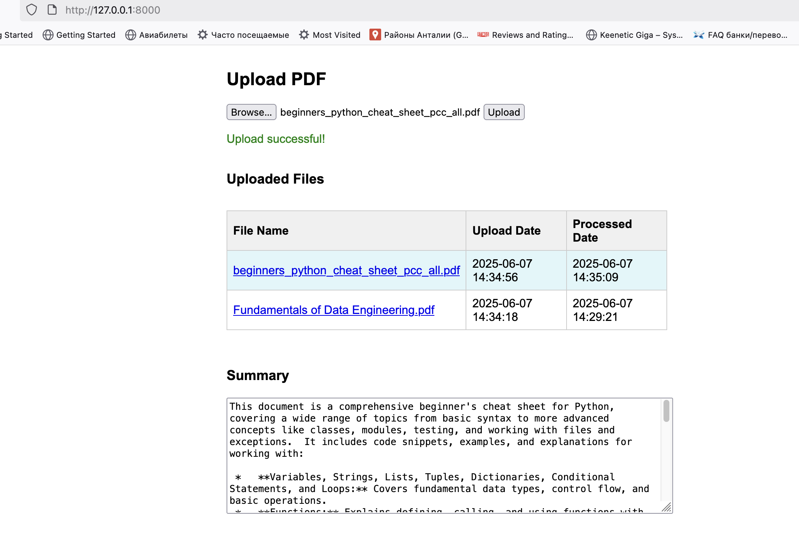

# PDF Summary Application



## Project Structure

```
pdf-summary/
│
├── app/
│   ├── __init__.py
│   ├── main.py           # Entry point for FastAPI app
│   ├── config.py
│   ├── processor.py
│   ├── data_classes.py
│   └── backend.py
│
├── static/
│   └── application_screenshot.png
│
├── templates/
│   └── index.html
│
├── uploads/
│   └── ...pdf files...
│
├── pdfs.db
├── README.md
├── launch_instructions.md
├── prompt.md
├── pyproject.toml
├── uv.lock
└── .gitignore
```

## Overview
This application allows users to upload PDF files, which are then summarized using the Gemini API. The results are displayed in a user-friendly web interface, with summaries and file metadata stored in a SQLite database. The backend is built with FastAPI and processes files asynchronously using Azure queues.

## Features
- **Upload PDF files** from your local machine
- **Asynchronous processing** of files via Azure queues
- **Summarization** using Gemini API
- **Persistent storage** of file name, upload date, and summary in SQLite
- **Results page** with:
  - List of uploaded files (file name, upload date, processing date)
  - Clickable file names to view summaries
  - Scrollable summary display
  - Automatic polling for new records

## Tech Stack
- **Front-End:** HTML, CSS, JavaScript (in `templates/`)
- **Back-End:** Python (FastAPI, in `app/`)
- **Database:** SQLite
- **Async Processing:** Azure Queues
- **Package Manager:** uv

## Usage
1. **Upload a PDF** via the web interface.
2. The file is sent to the backend and queued for processing.
3. The backend summarizes the PDF and stores the result in the database.
4. The results page displays all processed files and their summaries.

## Non-Functional Requirements
- Only HTML, CSS, and JavaScript for the front-end
- Python (FastAPI) for the back-end
- Asynchronous processing with Azure queues
- SQLite for data persistence
- Unique file names (uploads with the same name update existing records)

## Deployment
See `launch_instructions.md` for detailed deployment steps on Azure VM.

---

**Note:**
- All files are stored in the `uploads/` directory.
- The database file is `pdfs.db`.
- For any issues, please refer to the `README.md` and `launch_instructions.md` files.
